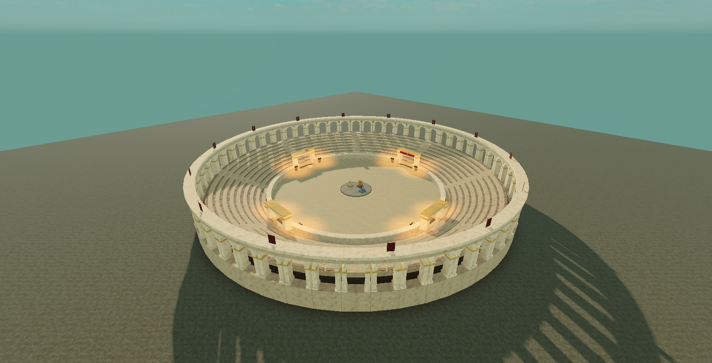
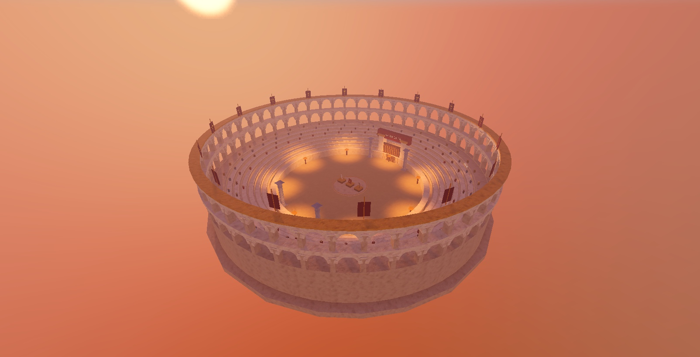
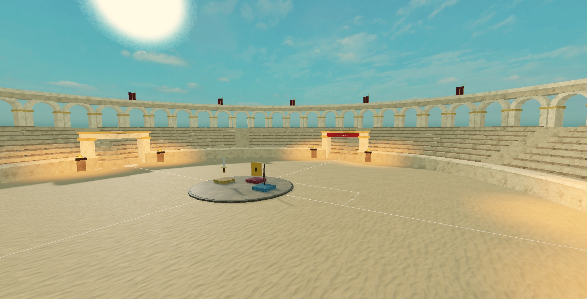
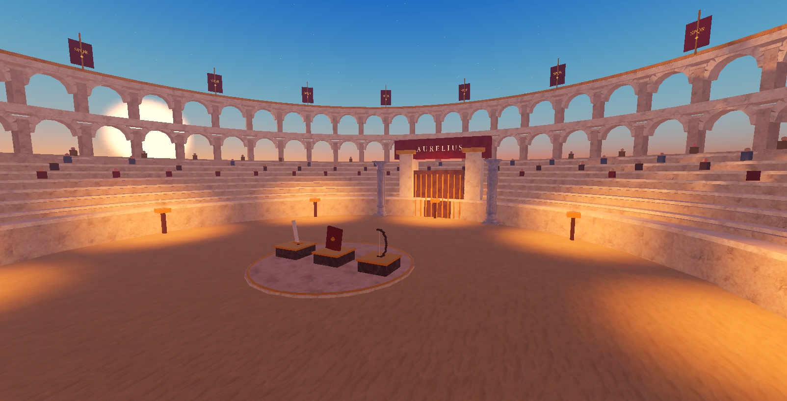

# Gladiator skill comparison

Exploratory test on September 15, 2026 (America/Chicago), Studio **0.739.0.7390687**, GPT-6 Astra. The whole draft bundle was moderately preferred in a label-blind visual review. This is not evidence of lower cost or of each change's independent benefit.

## Same brief, two fresh places

> Create a class-based gladiator tournament game where players fight until one remains. Set it in a Roman colosseum with stadium seating around a circular arena. Include a sword, a shield, and a bow with shootable arrows. Spawn equipment in the center for players to pick up and use.

- A used its own judgment; B read the rewritten skill, lighting/sound/particle/mechanical-polish references and both modules. Separate fresh agent contexts and Baseplates; A finished before B read the drafts.
- Both used official Studio MCP and could use free Creator Store assets. No ForgeGUI generation or publishing was exercised. A used primitives; B also used column asset `5264991027` and crowd audio `9119562843`.
- B installed both modules verbatim. Source readback matched after newline normalization. Owned-module capability configuration was needed for `require`; Future was recommended, not set. The parent supplied the known script-creation workaround and capability recovery after B encountered it.
- Tested source snapshot: builder `7624a02`, lighting `e28a4e6`, particles `79a85d2` (pre-squash draft commits, not in this repository). Review preparation later corrected documentation and particle ownership/cleanup; the lighting settings and particle numerical recipe values remain unchanged. The screenshots show the original test, not a rerun of the cleanup correction.

## Recorded results

| Measure | A: own judgment | B: draft bundle |
| --- | --- | --- |
| Scene | Nine seating tiers, single arcade, four gates | Seven tiers, double arcade, ceremonial gate, columns, audience silhouettes |
| Mood | Warm afternoon; clearer daylight visibility | Sunset preset; excessive orange haze weakens the wide view |
| Effects | Eight built-in fires/lights | Pickup sparkles, brazier embers, impact and landing bursts |
| Audio | None | Crowd loop reported loaded/playing; audible mix not assessed |
| Play checks | Classes, pickups, sword, shield, arrows, win/reset | Same features; transient effects cleared after reset |
| Test assistance | Staged combat targets; final win included forced bot elimination | Staged bow target; final win without forced health/death |
| Phone HUD | Not checked | Landscape overlap fixed and visually rechecked; full touch play unverified |
| Builder Studio calls | 109 attempts | 95 attempts, including cancelled capture |
| First mutation to stable Play | 1m40s | 3m36s |
| First mutation to final Edit audit/capture | 13m32s | 12m40s, including screenshot delay |

Timing excludes earlier reading/code preparation; call totals exclude parent setup, saving and evidence export. No token or cost telemetry was available. Both are prototypes: multiplayer, competitive balance, performance and audible mix quality were not qualified.

## Interpretation and limits

- A had clearer daylight; B's haze and bright light pools were weaknesses.
- Geometry, assets, scripts and framing differ. This comparison cannot isolate lighting, particles or the rewritten skill, and fewer calls do not demonstrate lower charges.
- An earlier campfire comparison favored A visually. The results are mixed across prompts; this gladiator pair supports further review, not a general quality guarantee.
- The reference-memory and paid-generation workflow was not exercised by these Studio-only tests.

## Follow-up regression on the reviewed particle code

The corrected module passed **30 ownership/cleanup assertions** through Studio MCP in Edit mode: borrowed attachments, metadata, unrelated children and external references survived; owned emitters/empty holders were removed; repeated attach/detach and explicit transient cleanup passed. Temporary test instances were removed. This check does not replace the original Play test or establish visual quality for every recipe.

To reproduce in an authorized test place, read the current `ParticleRecipes.luau`, replace its final `return M` with the contents of [particle-ownership-regression.luau](particle-ownership-regression.luau), and submit that combined source through Edit-mode `execute_luau`. The returned JSON should report `passed: 30`, `failed: 0` and `temporaryInstancesRemoved: true`. The test creates and removes only its own temporary objects; no persistent ModuleScript installation is needed.

## Overview

Arm A:

Arm B:

## Inside the arena

Arm A:

Arm B:

